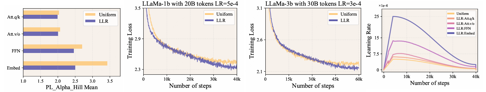
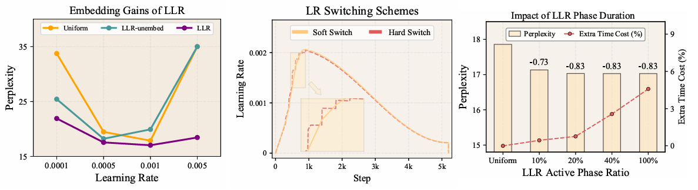
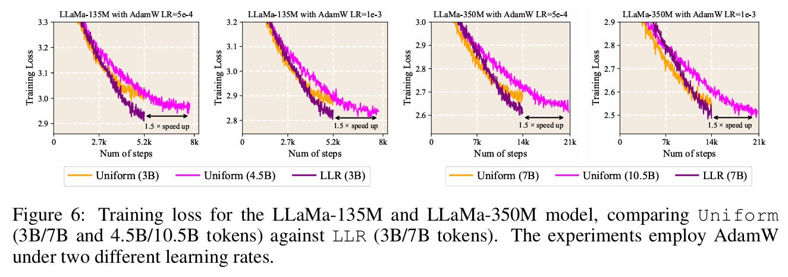

# One LR Doesn’t Fit All: Heavy-Tail Guided Layerwise Learning Rates for LLMs

This repo contains the pre-release version of LLR.  

LLR determines the Learning Rate parameter values of each layer in LLM training through the spectral characteristics of the ESD distribution and makes dynamic adjustments during the training process, thereby improving the training performance of the model.

<div align="center">
  
  
</div>

LLR consistently outperforms Uniform at equivalent token counts and attains comparable performance with approximately 1.5× fewer tokens, highlighting its effectiveness in accelerating convergence.

<div align="center">
  
</div>

## Table of contents

* [Abstract](#abstract)


* [Results](#Results)

* [Installation](#installation)

* [Usage](#Usage)


## TL;DR
We propose LLR, a spectral-based adaptive scheme that tailors learning rates per layer, achieving 1.5x speedup and improved accuracy with negligible tuning.

## Abstract

Learning rate configuration is a fundamental aspect of modern deep learning. The prevailing practice of applying a uniform learning rate across all layers overlooks the structural heterogeneity of Transformers, potentially limiting their effectiveness as the backbone of Large Language Models (LLMs). In this paper, we introduce Layerwise Learning Rate (LLR), an adaptive scheme that assigns distinct learning rates to individual Transformer layers. Our method is grounded in Heavy-Tailed Self-Regularization (HT-SR) theory, which characterizes the empirical spectral density (ESD) of weight correlation matrices to quantify heavy-tailedness. Layers with weaker heavy-tailedness are assigned larger learning rates to accelerate their training, while layers with stronger heavy-tailedness receive smaller learning rates. By tailoring learning rates in this manner, LLR promotes balanced training across layers, leading to faster convergence and improved generalization.
Extensive experiments across architectures (from LLaMA to GPT-nano), optimizers (AdamW and Muon), and parameter scales (60M–1B) demonstrate that LLR achieves up to 1.5× training speedup and outperforms baselines, notably raising average zero-shot accuracy from 47.09% to 49.02%. A key advantage of LLR is its low tuning overhead: it transfers nearly optimal LR settings directly from the uniform baseline.


## Results 

> **(Main result)** Comparison with LLR and all baselines on pre-training various sizes of LLaMa models on FineWeb dataset. Validation perplexity is reported.

| Model Size | `Uniform` | `LARS` | `LAMB` | `Sharpness` | `LLR` |
|---|---|---|---|---|---|
| 60M  | 21.94 | 52.52 | 23.53 | 23.28 | **20.30** |
| 135M | 17.86 | 32.78 | 18.59 | 18.54 | **17.03** |
| 350M | 12.96 | 19.04 | 14.56 | 14.91 | **12.71** |
| 1B   | 9.77  | 11.81 | 10.68 | 9.77  | **9.59** |

- [1] `LARS`: You et al., 2017 ([arxiv link](https://arxiv.org/pdf/1708.03888))
- [2] `LAMB`: You et al., 2019 ([arxiv link](https://arxiv.org/pdf/1904.00962))
- [3]  `Sharpness`: Wang et al., 2025 ([arxiv link](https://arxiv.org/pdf/2502.19002))

> **(Zero-shot results of commonsense-reasoning tasks)** Zero-shot evaluation results on seven commonsense reasoning benchmarks using the LLaMa-1B model pretrained with different methods.

| Method | `OBQA` | `Winogrande` | `ARC-c` | `ARC-e` | `Hellaswag` | `SIQA` | `PIQA` | `Avg.` |
|---|---|---|---|---|---|---|---|---|
| `Uniform` | 28.0 | 55.01 | 30.72 | 66.50 | 39.29 | 40.38 | 69.75 | 47.09 |
| `LARS` | 24.0 | 52.25 | 27.05 | 58.71 | 33.36 | 38.18 | 67.36 | 42.99 |
| `LAMB` | 24.6 | 50.59 | 29.27 | 62.37 | 36.45 | 39.30 | 68.01 | 44.37 |
| `Sharpness` | 26.0 | 53.59 | 30.80 | 67.72 | 39.36 | 40.89 | 70.40 | 46.97 |
| `LLR` | **29.6** | **56.67** | **34.64** | **70.46** | **40.53** | **40.79** | **70.46** | **49.02** |

We evaluate the pretrained LLaMa‑1B models, based on the checkpoints obtained from the pretraining experiments in Table **(Main result)**, on 7 zero-shot commonsense reasoning tasks with lm-eval-harness under its default prompt configuration. As shown in Table above, LLR achieves the best performance on all 7 benchmarks, boosting average accuracy from 47.09$\%$ to 49.02$\%$. This confirms that pretraining gains effectively transfer to downstream reasoning tasks.

> **(Up bound of LR scaling)** Validation perplexity of AdamW with a uniform LR matching the maximum LR from LLR’s scaling method of Table **(Main result)**.

| Model Size | 60M | 135M | 350M | 1B |
|---|---|---|---|---|
| `LR (Upbound)` | 0.005 | 0.005 | 0.005 | 0.0025 |
| `Uniform-Upbound` | 68.28 | 70.81 | 56.96 | 30.56 |
| `LLR` | **20.30** | **17.03** | **12.71** | **9.59** |

The table above presents the validation perplexity of different model sizes using AdamW optimizers with a uniform LR across all layers set to match the maximum Layerwise LR (upper bound) determined by LLR. LLR consistently outperforms both the upper bound and lower bound of uniform LR scaling across different model sizes. These findings confirm that a uniform LR configuration is inherently suboptimal, whereas the proposed layer-wise LR strategy enables a more effective utilization of the capabilities of different optimizers.

## Installation

### Setup

Our repository is built on top of [OLMo](https://github.com/allenai/OLMo) and [AlphaDecay](https://github.com/hed-ucas/AlphaDecay). You can configure the environment using the following command lines:
```bash
conda create -n llr python=3.11 -y
conda activate llr
conda install -r requirements
```

### Prepare Dataset

We utilized the publicly available [fineweb](https://huggingface.co/datasets/HuggingFaceFW/fineweb/tree/main) dataset, which can be accessed and downloaded from its respective official website.

## Usage

#### Pretraining LLama-1B on fineweb
```bash

torchrun --nproc_per_node=8 --master_port=36200 --master_addr=localhost scripts/train_llama.py \
  --config configs/llama_1024/llama-1B-t5-100B.yaml \
  --optimizer.name=adamw \
  --optimizer.learning_rate=0.0005 \
  --LLR.use_modulewise_lr=True \
  --LLR.alpha_positively_with_lr=True \
  --LLR.unbalancedlr_every=100 \
  --LLR.grad_alpha_metric=grad \
  --LLR.num_grad_steps=0 \
  --LLR.grad_unbalancedlr_every=1 \
  --LLR.assign_func=tb_linear_map \
  --LLR.lr_min_ratio=1 \
  --LLR.lr_max_ratio=5 \
  --LLR.linear_steps=50 \
  --swanlab.name=t5-1024-LLR0-1B-100B-lr0_0005-1-5 \
  --save_folder=workspace/t5-1024-LLR0-1B-100B-lr0_0005-1-5 \

```

### Acknowledgement
This repository is build upon the [OLMo](https://github.com/allenai/OLMo) and [AlphaDecay](https://github.com/hed-ucas/AlphaDecay) repositories. Thanks for their great work!
